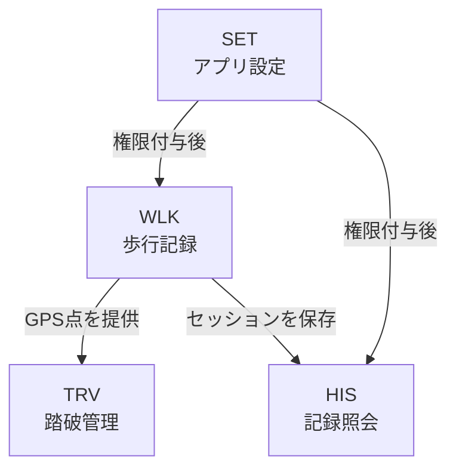
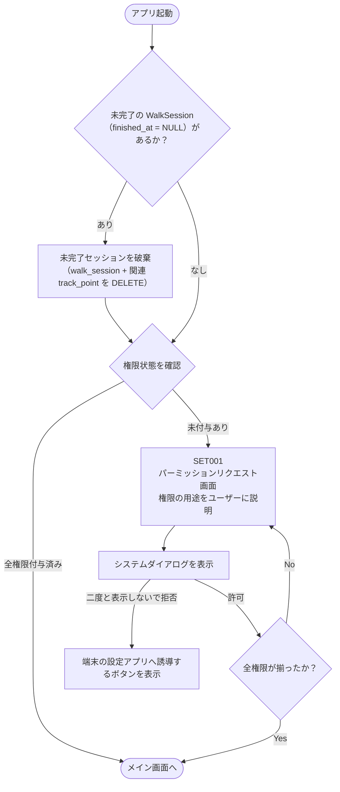
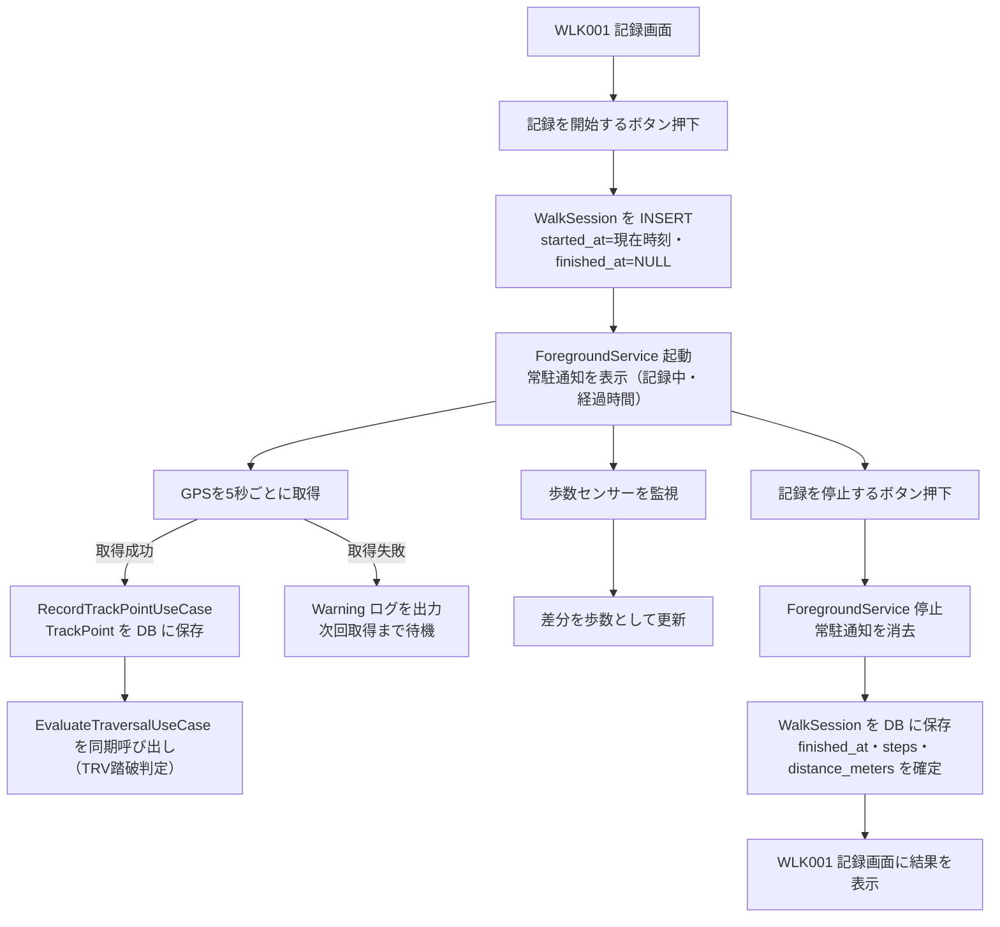
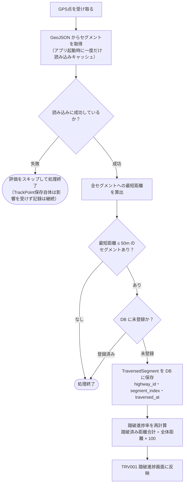
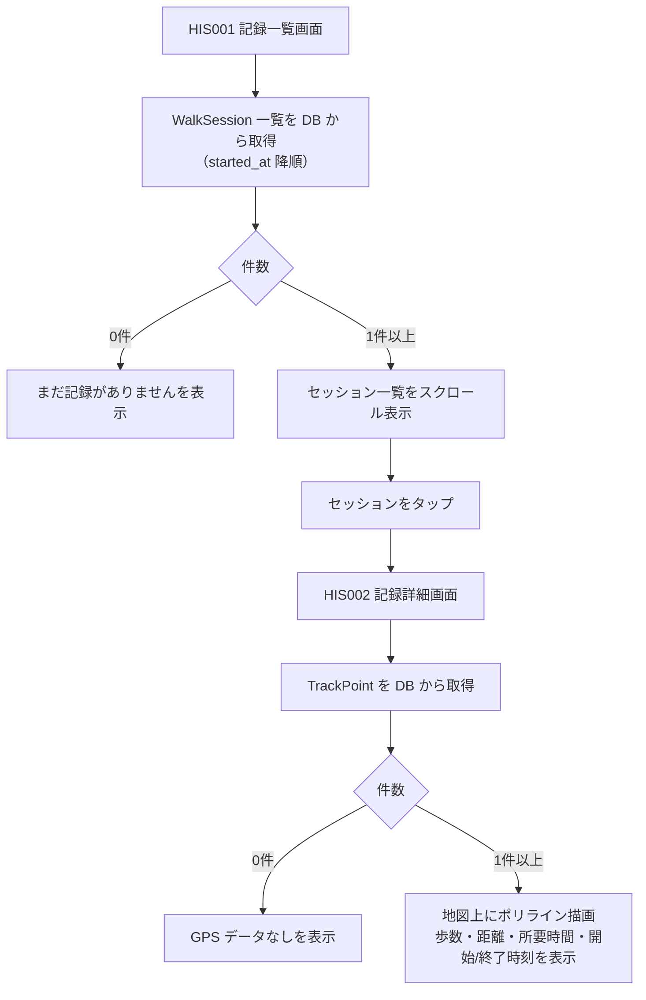

# 業務設計

参照：[基本設計](./basic-design.md) / [要件定義](../01-requirements/requirements.md)

---

## 業務一覧

| 業務ID | 業務名（日本語） | 業務名（英語） | 概要 |
|--------|--------------|--------------|------|
| SET | アプリ設定 | App Setup | 初回起動時に必要なパーミッションを取得する |
| WLK | 歩行記録 | Walk Recording | 歩行セッションの開始・GPS/歩数収集・停止・保存を行う |
| TRV | 踏破管理 | Traversal | GPS軌跡と旧街道を照合し、踏破進捗を管理する |
| HIS | 記録照会 | History Inquiry | 過去の歩行記録の一覧・詳細を閲覧する |

---

## 業務関連図

---

## 業務フロー

### SET：アプリ設定

> **未完了セッションの破棄方針**：強制終了時は `steps`・`distance_meters` が途中の値のまま残るため、不正確なデータとして起動時にサイレント削除する。ユーザーへの通知は行わない。

> **業務ごとの権限要否（指摘#13対応）**：権限が必要なのは WLK（記録開始時）のみ。TRV・HIS は Room DB / GeoJSON asset のみを参照するため権限に関わらず常に開ける。上記のアプリ起動時チェックに加え、WLK001 の「記録を開始する」ボタン押下時にも権限を再チェックし、不足があれば SET001 へ遷移する（設定アプリから戻った直後などに古い権限状態のままにならないための防御的チェック）。記録中に権限が剥奪された場合の挙動は [error-handling.md](../02-architecture-design/error-handling.md) を参照。参照：[permissions.md 業務別の権限要否](../02-architecture-design/permissions.md)

---

### WLK：歩行記録

---

### TRV：踏破管理

WLK の ForegroundService から `EvaluateTraversalUseCase` として同期呼び出しされる（Flow/Channel等の非同期連携ではなく直接呼び出し。参照：[background-tracking.md WLK → TRV のデータ受け渡し](../02-architecture-design/background-tracking.md)）。GPS 点が取得されるたびに実行するため、TRV001 画面を表示していない間も継続する。

> **GeoJSON読み込み失敗時の扱い（指摘#11/#20対応）**：GeoJSONはアプリ起動時に一度だけ読み込みキャッシュする。読み込みに失敗した場合は失敗状態もキャッシュし、以降のGPS点評価では再読み込みを試みずスキップする。WLK側のTrackPoint保存・記録自体には影響しない（踏破判定のみがスキップされる）。TRV001画面の表示は[error-handling.md](../02-architecture-design/error-handling.md)を参照。

---

### HIS：記録照会

