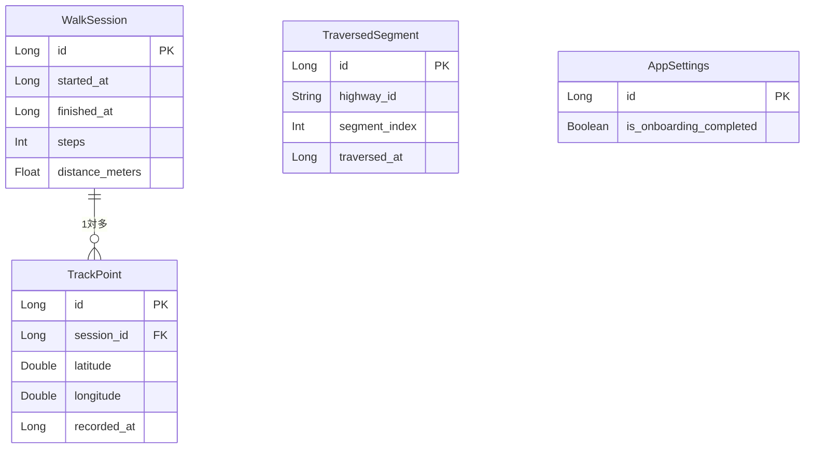

# テーブル一覧

参照：[データ設計](../data-design.md) / [アーキテクチャ設計](../../02-architecture-design/architecture.md)

---

## テーブル一覧

| テーブル名（物理名） | エンティティクラス名 | 概要 | 関連業務 |
|---------------------|---------------------|------|---------|
| `walk_session` | `WalkSession` | 歩行セッション。1回の開始〜停止を1レコードとして管理 | WLK・HIS |
| `track_point` | `TrackPoint` | GPS 軌跡点。セッションに紐づくGPS座標の時系列データ | WLK・TRV・HIS |
| `traversed_segment` | `TraversedSegment` | 踏破済みセグメント。旧街道の各区間の踏破状態を管理 | TRV |
| `app_settings` | `AppSettings` | アプリ全体設定。シングルトン（`id = 1` の1行のみ） | SET |

---

## ER 図

---

## 各テーブル定義

| ファイル | テーブル名 |
|---------|-----------|
| [walk-session.md](./walk-session.md) | `walk_session` |
| [track-point.md](./track-point.md) | `track_point` |
| [traversed-segment.md](./traversed-segment.md) | `traversed_segment` |
| [app-settings.md](./app-settings.md) | `app_settings` |
