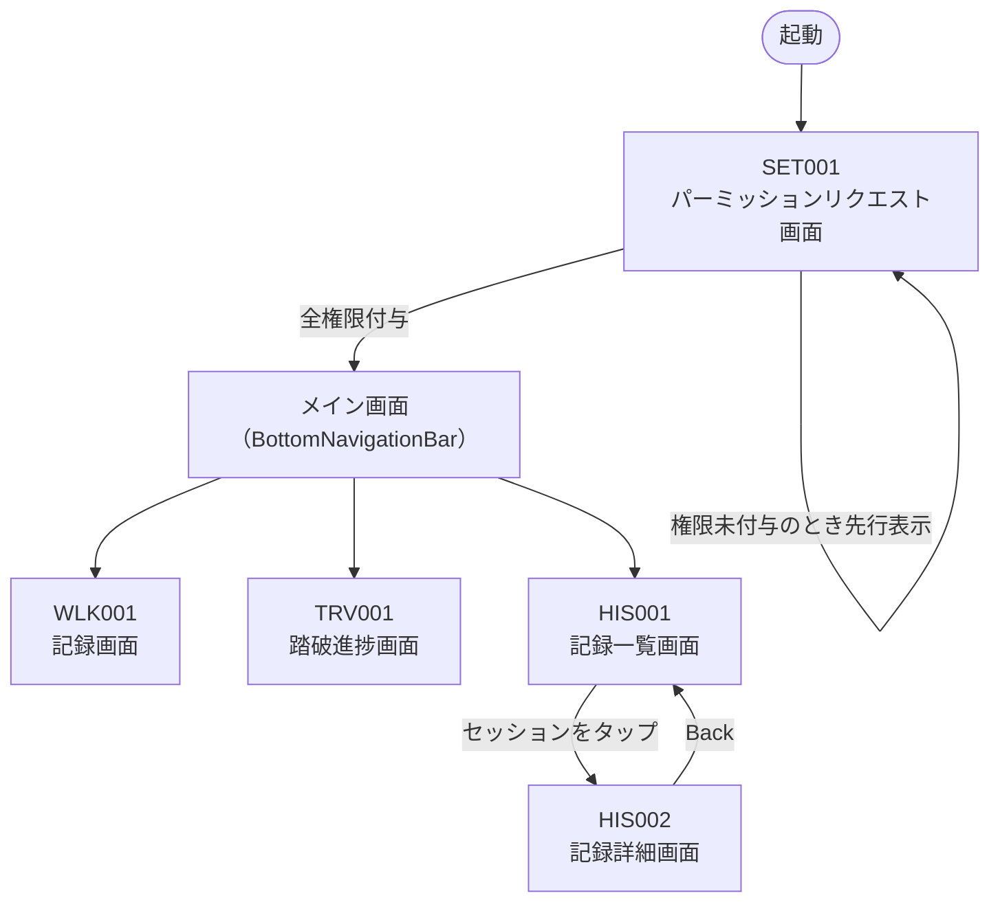

# 画面設計：画面一覧・画面遷移

参照：[基本設計](../basic-design.md)

---

## 画面一覧

| 画面ID | 画面名 | クラス名（Composable） | 概要 |
|--------|--------|----------------------|------|
| SET001 | パーミッションリクエスト画面 | `PermissionScreen` | 必要なパーミッションを説明してリクエストする |
| WLK001 | 記録画面 | `RecordingScreen` | 歩行の開始・停止、リアルタイム歩数・距離・軌跡の表示 |
| TRV001 | 踏破進捗画面 | `TraversalScreen` | 旧街道の踏破進捗率と踏破済み区間の地図表示 |
| HIS001 | 記録一覧画面 | `HistoryScreen` | 過去の歩行セッション一覧 |
| HIS002 | 記録詳細画面 | `SessionDetailScreen` | 過去の特定セッションの詳細と軌跡地図 |

---

## 画面遷移

BottomNavigationBar のタブ：

| タブ | 画面 |
|------|------|
| 記録 | RecordingScreen |
| 踏破 | TraversalScreen |
| 履歴 | HistoryScreen |

---

## 各画面ドキュメント

| 画面ID | 仕様書 | デザインカンプ | 画面名 |
|--------|--------|--------------|--------|
| SET001 | [SET001-permission.md](./SET001-permission.md) | [SET001-permission.html](./SET001-permission.html) | パーミッションリクエスト画面 |
| WLK001 | [WLK001-recording.md](./WLK001-recording.md) | [WLK001-recording.html](./WLK001-recording.html) | 記録画面（待機中・記録中・GPS取得中を切替表示） |
| TRV001 | [TRV001-traversal.md](./TRV001-traversal.md) | [TRV001-traversal.html](./TRV001-traversal.html) | 踏破進捗画面 |
| HIS001 | [HIS001-history.md](./HIS001-history.md) | [HIS001-history.html](./HIS001-history.html) | 記録一覧画面（カードクリックで HIS002 へ遷移） |
| HIS002 | [HIS002-session-detail.md](./HIS002-session-detail.md) | [HIS002-session-detail.html](./HIS002-session-detail.html) | 記録詳細画面 |

### デザインカンプの参照方法

- **ブラウザで開く** — HTML ファイルをそのまま開くと実機相当のデザインをインタラクティブに確認できます（Google Fonts CDN が必要）
- **AI実装時に参照** — 各 HTML の `<script>` ブロックにコンポーネント構成・デザイントークンの使用箇所がコメントで記述されています。`Read` ツールで読み込むことで実装仕様として参照できます
- **共有アセット** — `_design-assets/tokens.css`（デザイントークン）と `_design-assets/bundle.js`（コンポーネント）を参照しています。更新方法は [`_design-assets/README.md`](./_design-assets/README.md) を参照してください
